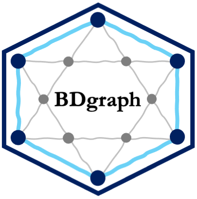

<!-- README.md is generated from README.Rmd. Please edit that file -->

# **BDgraph** <a href='https://CRAN.R-project.org/package=BDgraph'></a>

 
 
 
 

## Overview

The `R` package **BDgraph** provides statistical tools for Bayesian structure learning for undirected graphical models with *continuous*, *count*, *binary*, and *mixed data*. The package is implemented the recent improvements in the Bayesian graphical models' literature, including [Mohammadi and Wit (2015)](https://projecteuclid.org/euclid.ba/1422468425), [Mohammadi et al. (2021)](https://doi.org/10.1080/01621459.2021.1996377), [Mohammadi et al. (2017)](https://rss.onlinelibrary.wiley.com/doi/full/10.1111/rssc.12171), and [Dobra and Mohammadi (2018)](https://projecteuclid.org/euclid.aoas/1532743478). Besides, the package contains several functions for simulation and visualization, as well as several multivariate datasets taken from the literature. To speed up the computations, the computationally intensive tasks of the package are implemented in `C++` in parallel using **OpenMP**.

## Installation

You can install the latest version from CRAN using:

``` r
install.packages( "BDgraph" )
```

### Loading

``` r
library( BDgraph )
```

## Simple Examples for BDgraph package

To see how to use the functionality of the package:

* [Introduction to BDgraph](https://CRAN.R-project.org/package=BDgraph/vignettes/Introduction-BDgraph.html); 
* [BDgraph with Simple Examples](https://CRAN.R-project.org/package=BDgraph/vignettes/BDgraph-Examples.html).

See also [Mohammadi and Wit (2019)](https://www.jstatsoft.org/article/view/v089i03).


